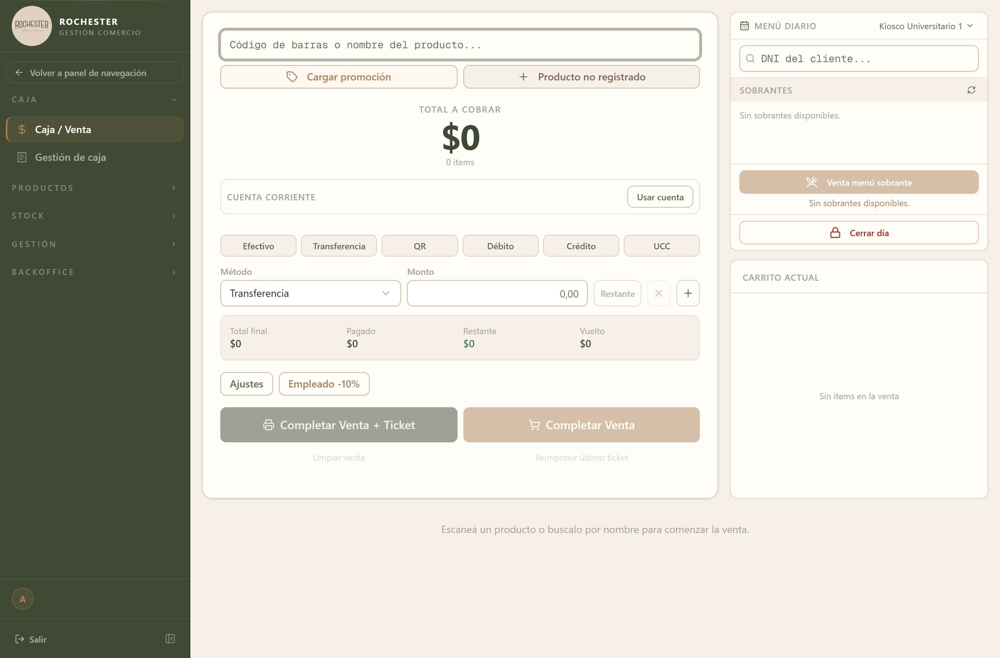

## 2. Ventas

### 2.1 Para qué sirve

<!-- PROSA:venta.proposito -->
Es la pantalla donde se cobra. Concentra todo el mostrador: se cargan los productos con el lector de código de barras o buscándolos por nombre, se aplican promociones y descuentos, se elige cómo paga el cliente y se cierra la operación con o sin ticket impreso.

Al confirmar una venta, el sistema descuenta el stock de cada producto del almacén en el que está trabajando, registra el cobro en la caja abierta e imputa la deuda si el cliente compra a cuenta corriente. Todo eso ocurre en un solo paso: si algo falla —por ejemplo, si un producto quedó sin stock suficiente— no se registra nada y la venta queda sin efecto.
<!-- /PROSA -->

### 2.2 Cómo llegar

En el menú lateral, abra **Caja** y elija **Caja / Venta**.

La pantalla se titula *Caja / Venta*.

También disponible en **Gestión → Historial de ventas** (*Ingresos*).

También disponible en **Gestión → Métricas** (*Métricas*).

### 2.3 Acciones disponibles

#### 2.3.1 Create

<!-- PROSA:venta.create.pasos -->
1. Escanee el código de barras del producto o escriba su nombre en el buscador del encabezado. El producto se agrega al **Carrito actual** y el **Total a cobrar** se actualiza solo.
2. Repita con todos los productos. Los que se venden **por peso** se cargan en gramos; los demás, por unidad.
3. Si corresponde una promoción, presione **Cargar promoción** y elíjala de la lista.
4. Si el artículo no está dado de alta, use **Producto no registrado** para cobrarlo indicando el importe a mano.
5. Si el cliente compra a crédito, presione **Usar cuenta** en el bloque **Cuenta corriente** y busque su cuenta.
6. Aplique descuentos o recargos con **Ajustes**, o use el botón **Empleado -10%** para el descuento de personal.
7. Elija el **método de pago** entre Efectivo, Transferencia, QR, Débito, Crédito y UCC. Para cobrar en varios medios, cargue el primero con su importe, presione **+** y agregue el siguiente; el bloque inferior le muestra en todo momento **Total final**, **Pagado**, **Restante** y **Vuelto**.
8. Cierre la operación con **Completar Venta**, o con **Completar Venta + Ticket** si el cliente lleva comprobante impreso.

> La suma de los pagos debe coincidir exactamente con el total de la venta. La única excepción son las ventas a cuenta corriente, donde el cliente puede entregar un pago inicial menor al total y el resto queda como deuda.

> Si se equivocó antes de cobrar, **Limpiar venta** vacía el carrito. Si ya cobró y necesita reimprimir, use **Reimprimir último ticket**.
<!-- /PROSA -->

**Datos a completar**

| Campo | Tipo | Obligatorio | Reglas |
| --- | --- | --- | --- |
| `usuarioId` | Número entero | **Sí** | — |
| `almacenId` | Número entero | **Sí** | — |
| `pagos` | Lista | **Sí** | — |
| `items` | Lista | **Sí** | — |
| `promociones` | Lista | No | — |
| `ajustes` | Lista | No | — |
| `tipoCobro` | Opción de lista | No | Valores: `CONTADO`, `CUENTA_CORRIENTE` |
| `cuentaCorrienteId` | Número entero | No | — |

*Detalle de `Venta pago`*

| Campo | Tipo | Obligatorio | Reglas |
| --- | --- | --- | --- |
| `medio` | MedioPagoVenta | **Sí** | — |
| `monto` | Número | **Sí** | Mínimo 0.01 |
| `detalle_pago` | Texto | No | Mín. 3 caracteres. Máx. DETALLE_PAGO_MAX_LENGTH caracteres |

*Detalle de `Venta item`*

| Campo | Tipo | Obligatorio | Reglas |
| --- | --- | --- | --- |
| `productoId` | Número entero | **Sí** | — |
| `cantidad` | Número entero | No | Mínimo 1 |
| `cantidad_gramos` | Número | No | Mínimo 0.001 |
| `precioUnitario` | Número | No | Mínimo 0 |

*Detalle de `Venta promo`*

| Campo | Tipo | Obligatorio | Reglas |
| --- | --- | --- | --- |
| `promocionId` | Número entero | **Sí** | — |
| `cantidad` | Número entero | **Sí** | — |

*Detalle de `Venta ajuste`*

| Campo | Tipo | Obligatorio | Reglas |
| --- | --- | --- | --- |
| `tipo` | Opción de lista | **Sí** | Valores: `DESCUENTO`, `RECARGO` |
| `modo` | Opción de lista | **Sí** | Valores: `PORCENTAJE`, `MONTO` |
| `valor` | Número | **Sí** | Mínimo 0.01 |
| `motivo` | Texto | **Sí** | Máx. 500 caracteres |
| `codigo` | Texto | No | Máx. 80 caracteres |
| `origen` | Opción de lista | No | Valores: `MANUAL`, `REGLA`, `MEDIO_PAGO` |

> ⚠️ Este formulario rechaza cualquier dato que no esté en la lista anterior.

**Mensajes que puede mostrar el sistema**

| Mensaje | Motivo / Cómo resolverlo |
| --- | --- |
| Almacen {dto.almacenId} no encontrado | <!-- PROSA:venta.error.almacen-no-encontrado --> El almacén seleccionado no existe o fue dado de baja. Verifique el almacén activo que figura arriba a la derecha. <!-- /PROSA --> |
| La venta debe incluir al menos un item o una promocion | <!-- PROSA:venta.error.la-venta-debe-incluir-al-menos-un-item-o-una-promocion --> Intentó cobrar con el carrito vacío. Cargue al menos un producto o una promoción antes de confirmar. <!-- /PROSA --> |
| cuentaCorrienteId es obligatorio para ventas a cuenta corriente | <!-- PROSA:venta.error.cuentacorrienteid-es-obligatorio-para-ventas-a-cuenta-corrie --> Eligió cobrar a cuenta corriente pero no indicó de qué cliente. Presione **Usar cuenta** y seleccione la cuenta antes de confirmar. <!-- /PROSA --> |
| cuentaCorrienteId solo puede enviarse con tipoCobro CUENTA_CORRIENTE | <!-- PROSA:venta.error.cuentacorrienteid-solo-puede-enviarse-con-tipocobro-cuenta-c --> Se asoció una cuenta corriente a una venta de contado. Quite la cuenta, o cambie la forma de cobro a cuenta corriente. <!-- /PROSA --> |

#### 2.3.2 Obtener ventas

<!-- PROSA:venta.obtenerVentas.pasos -->
1. Vaya a **Gestión → Historial de ventas**.
2. Acote la búsqueda con los filtros disponibles: rango de fechas, almacén, método de pago o usuario que registró la venta.
3. La lista muestra cada venta con su fecha, total y forma de cobro. Haga clic en una fila para ver el detalle completo.

Los totales que se muestran arriba corresponden al resultado filtrado, no a la totalidad de las ventas: si cambia los filtros, los importes se recalculan.
<!-- /PROSA -->

**Filtros disponibles**

| Filtro | Tipo | Obligatorio | Observación |
| --- | --- | --- | --- |
| `fechaDesde` | string | No | — |
| `fechaHasta` | string | No | — |
| `horaDesde` | string | No | — |
| `horaHasta` | string | No | — |
| `usuarioId` | string | No | — |
| `estado` | string | No | — |
| `almacenId` | string | No | — |
| `tipo` | string | No | — |
| `page` | string | No | Por defecto: `1` |
| `limit` | string | No | Por defecto: `50` |
| `ordenCampo` | string | No | Por defecto: `fecha` |
| `ordenDireccion` | 'ASC' \| 'DESC' | No | Por defecto: `DESC` |

#### 2.3.3 Obtener estadisticas

<!-- PROSA:venta.obtenerEstadisticas.pasos -->
1. Vaya a **Gestión → Métricas**.
2. Seleccione el período que quiere analizar.

La pantalla resume el desempeño del período: cantidad de ventas, importe total facturado, ticket promedio y la distribución por método de pago. Sirve para comparar jornadas o cerrar el mes.
<!-- /PROSA -->

**Filtros disponibles**

| Filtro | Tipo | Obligatorio | Observación |
| --- | --- | --- | --- |
| `(dto)` | Ver DTO `EstadisticasVentasDto` | **Sí** | — |

#### 2.3.4 Obtener total por categoria

<!-- PROSA:venta.obtenerTotalPorCategoria.pasos -->
Dentro de **Métricas**, este corte agrupa lo vendido por **categoría de producto** en el período elegido. Permite ver qué rubros concentran la facturación y detectar caídas de una categoría puntual.
<!-- /PROSA -->

**Filtros disponibles**

| Filtro | Tipo | Obligatorio | Observación |
| --- | --- | --- | --- |
| `fechaDesde` | string | No | — |
| `fechaHasta` | string | No | — |
| `almacenId` | string | No | — |

#### 2.3.5 Find one

<!-- PROSA:venta.findOne.pasos -->
Desde el historial de ventas, haga clic en la fila de la venta. Se abre el detalle con los productos vendidos, las cantidades, los importes y la forma de pago.
<!-- /PROSA -->

**Mensajes que puede mostrar el sistema**

| Mensaje | Motivo / Cómo resolverlo |
| --- | --- |
| ID inválido | <!-- PROSA:venta.error.id-invalido --> El identificador de la venta no es un número válido. Vuelva al historial y abra la venta desde la lista. <!-- /PROSA --> |
| Venta with ID {id} not found | <!-- PROSA:venta.error.venta-with-id-not-found --> La venta no existe o fue eliminada. Refresque el historial. <!-- /PROSA --> |

#### 2.3.6 Actualizar estado

<!-- PROSA:venta.actualizarEstado.pasos -->
Cambia el estado de una venta ya registrada. Se usa para marcar el avance de una operación que no se completa en el mostrador.
<!-- /PROSA -->

**Datos a completar**

| Campo | Tipo | Obligatorio | Reglas |
| --- | --- | --- | --- |
| `estado` | Texto | **Sí** | — |

#### 2.3.7 Get venta completa

<!-- PROSA:venta.getVentaCompleta.pasos -->
Es la vista ampliada de una venta. Además de los productos y los importes, muestra los **ajustes aplicados** (cada descuento o recargo con su motivo y el usuario que lo autorizó), los **pagos** discriminados por medio, y la cuenta corriente asociada si la hubiera. Es la vista que conviene usar cuando hay que auditar una operación puntual.
<!-- /PROSA -->

**Mensajes que puede mostrar el sistema**

| Mensaje | Motivo / Cómo resolverlo |
| --- | --- |
| ID inválido | <!-- PROSA:venta.error.id-invalido --> El identificador de la venta no es un número válido. Vuelva al historial y abra la venta desde la lista. <!-- /PROSA --> |
| Venta con ID {id} no encontrada | <!-- PROSA:venta.error.venta-con-id-no-encontrada --> La venta no existe o fue eliminada. Refresque el historial. <!-- /PROSA --> |

### 2.4 Estados y opciones

**Venta ajuste tipo**

| Valor | Significado |
| --- | --- |
| `DESCUENTO` | <!-- PROSA:venta.ventaajustetipo.descuento --> Resta dinero del total de la venta. <!-- /PROSA --> |
| `RECARGO` | <!-- PROSA:venta.ventaajustetipo.recargo --> Suma dinero al total de la venta, por ejemplo un interés por financiación. <!-- /PROSA --> |

**Venta ajuste modo**

| Valor | Significado |
| --- | --- |
| `PORCENTAJE` | <!-- PROSA:venta.ventaajustemodo.porcentaje --> El valor cargado se interpreta como un porcentaje del subtotal. Un descuento porcentual no puede superar el 100%. <!-- /PROSA --> |
| `MONTO` | <!-- PROSA:venta.ventaajustemodo.monto --> El valor cargado se descuenta o se suma como un importe fijo en pesos, sin importar el subtotal. <!-- /PROSA --> |

**Venta ajuste origen**

| Valor | Significado |
| --- | --- |
| `MANUAL` | <!-- PROSA:venta.ventaajusteorigen.manual --> Lo cargó el vendedor durante la venta, indicando el motivo. Queda registrado a su nombre. <!-- /PROSA --> |
| `REGLA` | <!-- PROSA:venta.ventaajusteorigen.regla --> Lo aplicó el sistema por una regla comercial configurada, como el descuento de empleado. <!-- /PROSA --> |
| `MEDIO_PAGO` | <!-- PROSA:venta.ventaajusteorigen.medio-pago --> Lo aplicó el sistema por el medio de pago elegido, como un recargo por tarjeta. <!-- /PROSA --> |

**Tipo cobro venta**

| Valor | Significado |
| --- | --- |
| `CONTADO` | <!-- PROSA:venta.tipocobroventa.contado --> El cliente paga la totalidad en el momento. La venta queda saldada. <!-- /PROSA --> |
| `CUENTA_CORRIENTE` | <!-- PROSA:venta.tipocobroventa.cuenta-corriente --> El cliente se lleva la mercadería y la deuda se imputa a su cuenta. Puede entregar un pago inicial parcial; el resto queda como saldo pendiente. <!-- /PROSA --> |

### 2.5 Otras validaciones del módulo

| Mensaje | Se produce en |
| --- | --- |
| Producto {itemDto.productoId} no encontrado | Armar items venta |
| Promocion {promoItem.promocionId} no esta activa | Armar items venta |
| Promocion {promoItem.promocionId} no esta disponible para el almacen {dto.almacenId} | Armar items venta |
| Promocion {promoItem.promocionId} no tiene productos | Armar items venta |
| La cantidad de la promocion debe ser mayor a 0 | Armar items venta |
| La promocion {promo.id} tiene gramos invalidos para producto {producto.id} | Armar items venta |
| La promocion {promo.id} tiene cantidad invalida para producto {producto.id} | Armar items venta |
| El ajuste #{index + 1} debe incluir un motivo | Calcular ajustes |
| El ajuste #{index + 1} debe tener un valor mayor a 0 | Calcular ajustes |
| El descuento porcentual #{index + 1} no puede superar el 100% | Calcular ajustes |
| Los descuentos no pueden dejar el total de la venta en negativo. Total calculado: {total} | Calcular ajustes |
| Producto {producto.id} se vende por gramos: enviar solo cantidad_gramos | Validar cantidad segun producto |
| Producto {producto.id} se vende por piezas: enviar solo cantidad | Validar cantidad segun producto |
| La venta debe incluir al menos un pago | Normalizar pagos |
| medio debe ser EFECTIVO, TRANSFERENCIA, QR, DEBITO, CREDITO u OTRO | Normalizar pagos |
| detalle_pago es obligatorio para pagos con medio OTRO | Normalizar pagos |
| detalle_pago no puede superar {DETALLE_PAGO_MAX_LENGTH} caracteres | Normalizar pagos |
| Cada pago debe tener un monto mayor a 0 | Normalizar pagos |
| La venta debe incluir al menos un pago | Normalizar pagos |
| La suma de pagos ({totalPagos}) debe coincidir con el total de la venta ({total}) | Validar total pagos |
| El pago inicial ({totalPagos}) no puede superar el total de la venta ({total}). Para generar saldo a favor, registrar un pago posterior en cuenta corriente. | Validar pago inicial cuenta corriente |
| No existe stock para producto {producto.id} en almacen {almacenId} | Descontar stock yregistrar movimiento tx |
