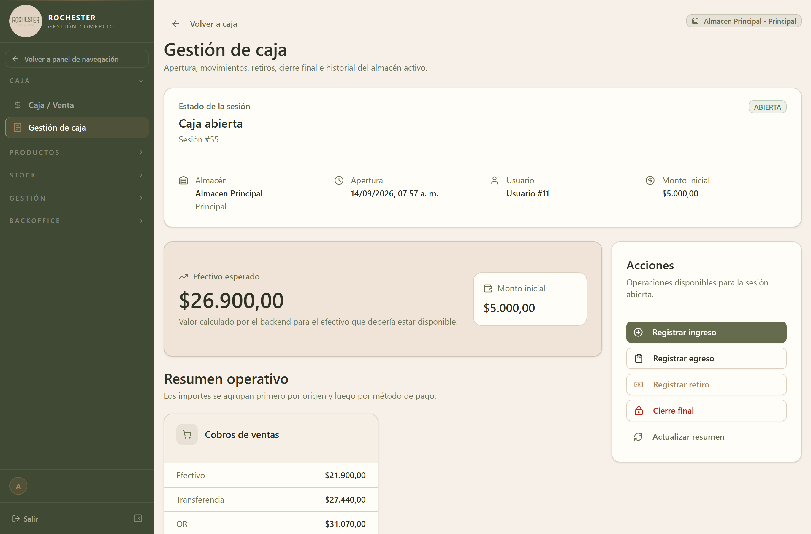

## 3. Caja

### 3.1 Para qué sirve

La caja representa su sesión de trabajo con dinero. Al comenzar el turno usted **abre la caja** declarando cuánto efectivo hay disponible para dar vuelto; durante la jornada el sistema registra automáticamente todo el dinero que entra y sale; y al terminar usted **cierra la caja** contando el efectivo real.

En ese momento el sistema compara lo que contó contra lo que debería haber según las operaciones registradas, y calcula la **diferencia**. Ese arqueo es el control principal sobre el manejo de dinero del punto de venta.

Cada almacén maneja su propia caja de forma independiente: puede haber una caja abierta por almacén al mismo tiempo, pero nunca dos en el mismo almacén.

### 3.2 Cómo llegar

En el menú lateral, abra **Caja** y elija **Gestión de caja**.

La pantalla se titula *Gestión de caja*.



El subtítulo de la pantalla resume su alcance: *apertura, movimientos, retiros, cierre final e historial del almacén activo*. Está organizada en tres bloques:

- **Estado de la sesión** — arriba de todo. Indica si la caja está `ABIERTA` o `CERRADA`, el número de sesión, y los datos de apertura: almacén, fecha y hora, usuario que la abrió y monto inicial.
- **Efectivo esperado** — el importe que debería haber en el cajón en este momento, calculado por el sistema. A su lado se repite el monto inicial como referencia.
- **Resumen operativo** — el desglose de los importes, agrupados primero por origen (*Cobros de ventas*, movimientos manuales) y dentro de cada origen por método de pago.

A la derecha, el panel **Acciones** reúne las operaciones disponibles para la sesión abierta: **Registrar ingreso**, **Registrar egreso**, **Registrar retiro**, **Cierre final** y **Actualizar resumen**.

> El almacén sobre el que está trabajando se muestra siempre arriba a la derecha (*Almacén Principal*). Verifíquelo antes de registrar cualquier movimiento: cada almacén tiene su propia caja.

> El botón **Actualizar resumen** vuelve a pedir los totales al sistema. Úselo si estuvo cobrando desde otra pantalla y quiere ver los importes al día sin recargar el navegador.

### 3.3 Acciones disponibles

#### 3.3.1 Abrir la caja

1. Ingrese a **Caja → Gestión de caja**.
2. Si no hay una sesión en curso, la pantalla ofrece **Abrir caja**. Presiónelo.
3. Seleccione el **almacén** en el que va a trabajar.
4. Cargue el **monto inicial**: el efectivo con el que arranca el turno, contado de forma manual.
5. Si corresponde, agregue una **observación** (por ejemplo, "faltaba cambio de $500").
6. Confirme. A partir de ese momento todas las ventas y movimientos quedan asociados a esta sesión.

> El monto inicial no se puede modificar una vez abierta la caja. Si se equivocó, registre la corrección como un movimiento manual dejando constancia en el motivo.

**Datos a completar**

| Campo | Tipo | Obligatorio | Reglas |
| --- | --- | --- | --- |
| `almacen_id` | Número | **Sí** | — |
| `monto_inicial` | Número | **Sí** | Mínimo 0 |
| `observacion` | Texto | No | Máx. 500 caracteres |

**Mensajes que puede mostrar el sistema**

| Mensaje | Motivo / Cómo resolverlo |
| --- | --- |
| Ya existe una caja abierta para el almacén {almacen} (sesión #{id}) | Ese almacén tiene una sesión sin cerrar, probablemente del turno anterior. Ciérrela antes de abrir una nueva. |

#### 3.3.2 Ver la caja activa

El panel superior de *Gestión de caja* muestra el estado en vivo de la sesión abierta del almacén: monto inicial, total de ingresos y egresos, y el **efectivo esperado** en el cajón hasta el momento. Es la consulta rápida durante el turno.

**Filtros disponibles**

| Filtro | Tipo | Obligatorio | Observación |
| --- | --- | --- | --- |
| `almacen_id` | Número | **Sí** | Almacén cuya caja abierta se quiere consultar |

**Mensajes que puede mostrar el sistema**

| Mensaje | Motivo / Cómo resolverlo |
| --- | --- |
| No hay caja abierta para el almacén {almacen} | Nadie abrió la caja en ese almacén todavía. Ábrala para poder operar. |

#### 3.3.3 Consultar el historial de cajas

1. Ingrese a **Caja → Gestión de caja**.
2. Filtre por almacén y rango de fechas según lo que necesite revisar.
3. Haga clic en cualquier sesión para ver su reporte de cierre completo.

Los resultados se muestran paginados: use los controles del pie de la tabla para avanzar.

**Filtros disponibles**

| Filtro | Tipo | Obligatorio | Observación |
| --- | --- | --- | --- |
| `almacen_id` | Número | No | Si se omite, muestra todos los almacenes |
| `desde` | Fecha | No | Fecha de apertura mínima |
| `hasta` | Fecha | No | Fecha de apertura máxima |
| `page` | Número | No | Por defecto: `1` |
| `limit` | Número | No | Por defecto: `20` registros por página |

#### 3.3.4 Ver el reporte de una caja

Es el comprobante de la sesión. Incluye el monto inicial, el desglose de ingresos y egresos por medio de pago, el efectivo esperado, el efectivo contado al cierre y la diferencia resultante. Se puede consultar tanto en cajas abiertas (con datos parciales) como cerradas.

#### 3.3.5 Ver los movimientos de la caja

La tabla inferior de la pantalla lista todo lo que entró y salió de la caja durante la sesión: ventas cobradas, retiros, gastos y ajustes manuales. Puede filtrar por tipo, medio de pago y origen para auditar un caso puntual.

#### 3.3.6 Registrar un movimiento manual

Se usa para el dinero que entra o sale por fuera de una venta: un retiro a la bóveda, el pago de un flete, un ingreso de cambio.

La pantalla ofrece un botón por cada tipo de movimiento, así que el tipo queda determinado por el botón que presione:

| Botón | Tipo de movimiento | Cuándo usarlo |
| --- | --- | --- |
| **Registrar ingreso** | `INGRESO` | Entra dinero a la caja por un concepto distinto de una venta. |
| **Registrar egreso** | `EGRESO` | Sale dinero para cubrir un gasto. |
| **Registrar retiro** | `RETIRO` | Se extrae efectivo de la caja, por ejemplo hacia la bóveda. |

1. Con la caja abierta, presione el botón correspondiente al movimiento que va a registrar.
2. Cargue el **monto**, que debe ser mayor a cero.
3. Seleccione el **medio de pago**. Si elige `OTRO`, el campo **detalle de pago** pasa a ser obligatorio.
4. Escriba el **motivo**: es obligatorio y queda asentado en el reporte de cierre.
5. Confirme. El movimiento aparece en la tabla y el resumen superior se recalcula.

> ⚠️ Los movimientos no se editan. Si se equivocó, debe anularlo y registrar uno nuevo.

**Datos a completar**

| Campo | Tipo | Obligatorio | Reglas |
| --- | --- | --- | --- |
| `tipo` | Opción de lista | **Sí** | Valores: `INGRESO`, `EGRESO`, `RETIRO` |
| `monto` | Número | **Sí** | Mínimo 0.01 |
| `medio_pago` | Opción de lista | No | Valores: `EFECTIVO`, `TRANSFERENCIA`, `QR`, `DEBITO`, `CREDITO`, `OTRO` |
| `detalle_pago` | Texto | No | Obligatorio si el medio de pago es `OTRO`. Mín. 3 caracteres |
| `motivo` | Texto | **Sí** | Mín. 3 caracteres. Máx. 500 caracteres |
| `observacion` | Texto | No | Máx. 500 caracteres |

**Mensajes que puede mostrar el sistema**

| Mensaje | Motivo / Cómo resolverlo |
| --- | --- |
| medio_pago debe ser EFECTIVO, TRANSFERENCIA, QR, DEBITO, CREDITO, OTRO o BANCARIZADO | Se envió un medio de pago que no está en la lista. Seleccione uno del desplegable. |
| detalle_pago es obligatorio para movimientos con medio_pago OTRO | Eligió "Otro" como medio de pago: describa de qué se trata en el campo de detalle. |
| tipo debe ser INGRESO, EGRESO o RETIRO | Seleccione el tipo de movimiento desde la lista. |

#### 3.3.7 Cerrar la caja

1. Al terminar el turno, cuente físicamente todo el efectivo del cajón.
2. En *Gestión de caja*, presione **Cierre final**.
3. Cargue en **efectivo contado** el total que contó, sin descontar el monto inicial.
4. Confirme. El sistema calcula la diferencia y emite el reporte de cierre.

Al confirmar, la sesión pasa a estado `CERRADA` y ya no admite movimientos nuevos.

**Cómo se calcula la diferencia**

```
efectivo esperado  =  monto inicial
                    + cobros en efectivo
                    + ingresos manuales en efectivo
                    − egresos y retiros en efectivo

diferencia         =  efectivo contado − efectivo esperado
```

Una diferencia **positiva** significa sobrante en el cajón; una **negativa**, faltante. El sistema no bloquea el cierre por diferencia: la registra para su revisión posterior.

**Datos a completar**

| Campo | Tipo | Obligatorio | Reglas |
| --- | --- | --- | --- |
| `efectivo_contado` | Número | **Sí** | Mínimo 0 |

#### 3.3.8 Anular un movimiento

1. Ubique el movimiento en la tabla de movimientos de la caja.
2. Presione **Anular** en la fila correspondiente.
3. Escriba el **motivo de la anulación**. Es obligatorio y queda registrado.
4. Confirme.

El movimiento no se borra: queda marcado como anulado y deja de sumar al total de la caja, conservando la trazabilidad.

**Datos a completar**

| Campo | Tipo | Obligatorio | Reglas |
| --- | --- | --- | --- |
| `motivo_anulacion` | Texto | **Sí** | Mín. 5 caracteres. Máx. 500 caracteres |

**Mensajes que puede mostrar el sistema**

| Mensaje | Motivo / Cómo resolverlo |
| --- | --- |
| Movimiento #{id} no encontrado | El movimiento no existe o pertenece a otra caja. Refresque la lista. |
| El movimiento #{id} ya está anulado | Alguien lo anuló antes. No hace falta hacer nada. |
| Este movimiento proviene de un pago de cuenta corriente. Debe anularse desde cuenta corriente. | El movimiento se generó automáticamente al cobrar una cuenta corriente. Anule el pago desde el módulo **Cuentas corrientes** y la caja se corregirá sola. |
| La caja ya se encuentra cerrada | No se pueden anular movimientos de una sesión cerrada. |

### 3.4 Movimientos que genera el sistema por su cuenta

No todo lo que aparece en la caja lo carga una persona. Conviene conocer estos casos para no registrarlos dos veces:

- **Cobros de venta.** Cada venta cobrada impacta en la caja según su medio de pago. No hace falta registrar un ingreso adicional.
- **Pagos de cuenta corriente.** Cuando un cliente salda su cuenta, el sistema genera el movimiento con origen `CUENTA_CORRIENTE`. Solo se anula desde ese módulo.
- **Gastos de órdenes de compra.** Al recibir mercadería con una orden de compra, el sistema crea el gasto asociado (aparece identificado como "Gasto generado a…"). No lo cargue también como egreso manual.

### 3.5 Estados y opciones

**Estado de la sesión de caja**

| Valor | Significado |
| --- | --- |
| `ABIERTA` | Sesión en curso. Admite ventas y movimientos. Es la única que puede cerrarse. |
| `CERRADA` | Turno finalizado y arqueado. Solo lectura: ya no admite movimientos ni anulaciones. |

**Origen del movimiento**

| Valor | Significado |
| --- | --- |
| `MANUAL` | Lo cargó un usuario desde la pantalla de caja. Se puede anular desde aquí. |
| `CUENTA_CORRIENTE` | Lo generó el sistema al registrarse el pago de una cuenta corriente. Solo se anula desde ese módulo. |

**Tipo de movimiento**

| Valor | Significado |
| --- | --- |
| `INGRESO` | Entra dinero a la caja por un concepto distinto de una venta. |
| `EGRESO` | Sale dinero para cubrir un gasto. |
| `RETIRO` | Se extrae efectivo de la caja (por ejemplo, hacia la bóveda). |

### 3.6 Ciclo de vida de una caja

```
  Apertura                Operación del turno              Cierre
 ┌──────────┐        ┌───────────────────────┐        ┌──────────┐
 │ ABIERTA  │ ─────▶ │ ventas · movimientos  │ ─────▶ │ CERRADA  │
 │          │        │ anulaciones           │        │ arqueada │
 └──────────┘        └───────────────────────┘        └──────────┘
   monto              el sistema acumula el            efectivo contado
   inicial            efectivo esperado                − esperado = diferencia
```

### 3.7 Otras validaciones del módulo

| Mensaje | Cuándo aparece |
| --- | --- |
| Parametro numerico invalido: {valor} | Se envió texto donde se esperaba un número (por ejemplo, en un filtro). |
| order debe ser ASC o DESC | El criterio de ordenamiento de la lista no es válido. |
| origen debe ser MANUAL o CUENTA_CORRIENTE | El filtro de origen recibió un valor fuera de la lista. |
