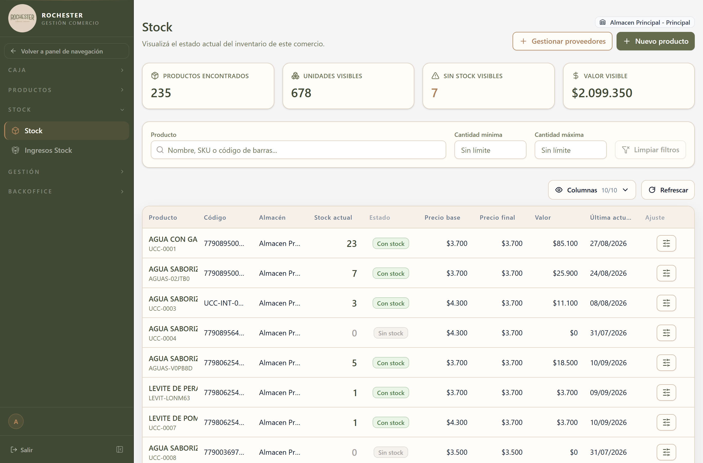

## 5. Stock

### 5.1 Para qué sirve

<!-- PROSA:stock-actual.proposito -->
Muestra cuánta mercadería hay en este momento en el almacén y cuánto vale. Es la pantalla de consulta del inventario: qué productos están por agotarse, cuáles quedaron en cero y cuál es el valor total de lo que hay en góndola y depósito.

El stock no se carga a mano en el día a día: lo mueve el sistema. Cada venta descuenta, cada ingreso de mercadería suma, y cada ajuste queda registrado como un movimiento con su motivo. Esta pantalla es el resultado de todo eso.
<!-- /PROSA -->

### 5.2 Cómo llegar

En el menú lateral, abra **Stock** y elija **Stock**.

La pantalla se titula *Stock*.

### 5.3 Acciones disponibles

#### 5.3.1 Get all

<!-- PROSA:stock-actual.getAll.pasos -->
1. En el menú lateral, abra **Stock** y elija **Stock**.
2. Use el buscador para filtrar por **nombre, SKU o código de barras**, o acote por **cantidad mínima** y **cantidad máxima** para aislar los productos con poca existencia.
3. **Limpiar filtros** vuelve a mostrar el inventario completo.

Los cuatro indicadores del encabezado —**Productos encontrados**, **Unidades visibles**, **Sin stock visibles** y **Valor visible**— se recalculan según lo que dejen los filtros, no sobre el inventario total. Es la forma rápida de responder "cuánto vale lo que tengo de esta categoría".

Con **Columnas** puede mostrar u ocultar columnas de la tabla, y con **Refrescar** vuelve a pedir los datos al sistema.
<!-- /PROSA -->

**Filtros disponibles**

| Filtro | Tipo | Obligatorio | Observación |
| --- | --- | --- | --- |
| `new ValidationPipe({         transform: true,         whitelist: true,         forbidNonWhitelisted: true,       })` | QueryStockActualDto | **Sí** | — |

#### 5.3.2 Get stock by almacen

<!-- PROSA:stock-actual.getStockByAlmacen.pasos -->
La pantalla muestra siempre el stock del **almacén activo**, el que figura arriba a la derecha. Si maneja más de un punto de venta, cambie de almacén para ver sus existencias: cada uno lleva su inventario por separado.
<!-- /PROSA -->

#### 5.3.3 Get one

<!-- PROSA:stock-actual.getOne.pasos -->
Haga clic en la fila del producto para ver su detalle: existencia actual, precio base, precio final y fecha de la última actualización.
<!-- /PROSA -->

#### 5.3.4 Registrar entrada

<!-- PROSA:stock-actual.registrarEntrada.pasos -->
Suma mercadería al stock de un producto sin pasar por una orden de compra. Se usa para correcciones de inventario y cargas puntuales.

1. Ubique el producto en la lista y abra el botón de **ajuste** de su fila.
2. Indique la cantidad que ingresa. Si el producto se vende **por peso**, la cantidad se carga en gramos; si se vende por unidad, en piezas.
3. Confirme.

> Toda entrada queda registrada como un movimiento de stock con su fecha y su responsable. Para la mercadería que llega de un proveedor, use **Ingresos Stock**: así el sistema genera además la orden de compra y el gasto correspondiente.
<!-- /PROSA -->

**Datos a completar**

| Campo | Tipo | Obligatorio | Reglas |
| --- | --- | --- | --- |
| `producto_id` | Número entero | **Sí** | Mínimo 1 |
| `almacen_id` | Número entero | **Sí** | Mínimo 1 |
| `cantidad` | Número entero | No | Mínimo 0 |
| `cantidad_gramos` | Número | No | Mínimo 0 |
| `motivo` | Texto | No | — |
| `proveedor_id` | Número entero | No | Mínimo 1 |
| `precioUnitario` | Número | No | Mínimo 0 |
| `precioTotal` | Número | No | Mínimo 0 |

**Mensajes que puede mostrar el sistema**

| Mensaje | Motivo / Cómo resolverlo |
| --- | --- |
| Producto {dto.producto_id} no existe | <!-- PROSA:stock-actual.error.producto-no-existe --> El producto fue eliminado o el código es incorrecto. Búsquelo en la lista de productos y verifique que siga dado de alta. <!-- /PROSA --> |

#### 5.3.5 Registrar insumo

<!-- PROSA:stock-actual.registrarInsumo.pasos -->
Descuenta mercadería que se consume internamente y no se vende: lo que se usa para preparar otro producto, lo que se rompe o lo que se da de baja.

1. Ubique el producto y abra el ajuste de su fila.
2. Elija registrar un **insumo** e indique la cantidad consumida.
3. Confirme. El stock baja y queda asentado el movimiento.

> A diferencia de una venta, un insumo no genera cobro ni impacta en la caja: solo reduce la existencia.
<!-- /PROSA -->

**Datos a completar**

| Campo | Tipo | Obligatorio | Reglas |
| --- | --- | --- | --- |
| `producto_id` | Número entero | **Sí** | — |
| `almacen_id` | Número entero | **Sí** | — |
| `cantidad` | Número entero | No | Mínimo 0 |
| `cantidad_gramos` | Número | No | Mínimo 0 |

**Mensajes que puede mostrar el sistema**

| Mensaje | Motivo / Cómo resolverlo |
| --- | --- |
| Producto {dto.producto_id} no existe | <!-- PROSA:stock-actual.error.producto-no-existe --> El producto fue eliminado o el código es incorrecto. Búsquelo en la lista de productos y verifique que siga dado de alta. <!-- /PROSA --> |
| Stock no encontrado para producto {dto.producto_id} en almacén {dto.almacen_id} | <!-- PROSA:stock-actual.error.stock-no-encontrado-para-producto-en-almacen --> Ese producto todavía no tiene existencia registrada en este almacén. Regístrele primero una entrada, o ingréselo por una orden de compra. <!-- /PROSA --> |

#### 5.3.6 Cancelar insumo

<!-- PROSA:stock-actual.cancelarInsumo.pasos -->
Revierte un consumo registrado por error. El sistema devuelve la cantidad al stock del almacén de origen y elimina el movimiento.

Solo se pueden cancelar movimientos que sean de tipo insumo. Para revertir una venta o un ingreso de mercadería hay que hacerlo desde su propio módulo.
<!-- /PROSA -->

**Datos a completar**

| Campo | Tipo | Obligatorio | Reglas |
| --- | --- | --- | --- |
| `movimiento_id` | Número entero | **Sí** | — |

#### 5.3.7 Create

<!-- PROSA:stock-actual.create.pasos -->
Da de alta la existencia de un producto en un almacén donde todavía no tenía registro. Es un paso excepcional: lo habitual es que el stock se cree solo la primera vez que el producto ingresa por una orden de compra.
<!-- /PROSA -->

**Datos a completar**

| Campo | Tipo | Obligatorio | Reglas |
| --- | --- | --- | --- |
| `producto_id` | Número entero | **Sí** | Mínimo 1 |
| `almacen_id` | Número entero | **Sí** | Mínimo 1 |
| `cantidad` | Número entero | No | Mínimo 0 |
| `cantidad_gramos` | Número | No | Mínimo 0 |
| `motivo` | Texto | No | — |
| `proveedor_id` | Número entero | No | Mínimo 1 |
| `precioUnitario` | Número | No | Mínimo 0 |
| `precioTotal` | Número | No | Mínimo 0 |

#### 5.3.8 Update

<!-- PROSA:stock-actual.update.pasos -->
Corrige la existencia registrada de un producto, para cuando el conteo físico no coincide con lo que muestra el sistema.

> Use esta opción con criterio: fija el número directamente en lugar de sumar o restar. Si lo que necesita es dejar constancia de por qué cambió la cantidad, conviene registrar una entrada o un insumo, que quedan documentados como movimientos.
<!-- /PROSA -->

#### 5.3.9 Remove

<!-- PROSA:stock-actual.remove.pasos -->
Elimina el registro de stock de un producto en un almacén. Se usa cuando un producto deja de comercializarse en ese punto de venta.
<!-- /PROSA -->

**Mensajes que puede mostrar el sistema**

| Mensaje | Motivo / Cómo resolverlo |
| --- | --- |
| Stock no encontrado para producto {producto_id} en almacén {almacen_id} | <!-- PROSA:stock-actual.error.stock-no-encontrado-para-producto-en-almacen --> Ese producto todavía no tiene existencia registrada en este almacén. Regístrele primero una entrada, o ingréselo por una orden de compra. <!-- /PROSA --> |

### 5.5 Otras validaciones del módulo

| Mensaje | Se produce en |
| --- | --- |
| cantidadMin no puede ser mayor que cantidadMax | Find all |
| Stock no encontrado para producto {producto_id} en almacén {almacen_id} | Find one |
| Producto {productoId} no existe | Ajustar stock tx |
| No existe stock para producto {productoId} en almacén {almacenId} | Ajustar stock tx |
