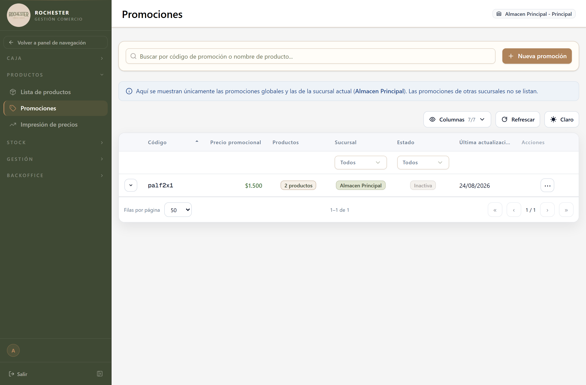

## 7. Promociones

### 7.1 Para qué sirve

Combo o descuento aplicable a una venta.

<!-- PROSA:promocion.proposito -->
Permite vender un conjunto de productos a un precio cerrado, distinto de la suma de sus precios individuales: el combo, la docena, el 2x1.

Cada promoción tiene un **código** con el que se la llama desde la pantalla de venta, un **precio promocional** y la lista de productos que la componen con sus cantidades. Puede ser general —vale en todos los almacenes— o quedar limitada a uno solo.

Al cobrarla, el sistema descuenta del stock cada producto que la integra, en la cantidad que corresponda.
<!-- /PROSA -->

### 7.2 Cómo llegar

En el menú lateral, abra **Productos** y elija **Promociones**.

La pantalla se titula *Promociones*.

### 7.3 Acciones disponibles

#### 7.3.1 Create

<!-- PROSA:promocion.create.pasos -->
1. En el menú lateral, abra **Productos** y elija **Promociones**.
2. Presione el botón para crear una promoción.
3. Cargue el **código** con el que se la va a llamar en la venta. Elija algo corto y fácil de tipear.
4. Cargue el **precio promocional**: lo que paga el cliente por el combo completo.
5. Agregue los **productos** que la componen. De cada uno indique la cantidad: **en piezas** si el producto se vende por unidad, **en gramos** si se vende por peso.
6. Elija el **almacén** si la promoción es solo para un punto de venta, o déjelo vacío para que valga en todos.
7. Confirme.

> El código no puede repetirse. Si ya existe una promoción con ese código, el sistema lo avisa; cuando la que lo ocupa está activa, además muestra qué productos la componen, para que pueda comparar antes de decidir.
<!-- /PROSA -->

**Datos a completar**

| Campo | Tipo | Obligatorio | Reglas |
| --- | --- | --- | --- |
| `codigo` | Texto | **Sí** | — |
| `precioPromo` | Número | **Sí** | — |
| `almacenId` | Número entero | No | Mínimo 1 |
| `productos` | Lista | **Sí** | — |

*Detalle de `Producto in promocion`*

| Campo | Tipo | Obligatorio | Reglas |
| --- | --- | --- | --- |
| `productoId` | Número | **Sí** | — |
| `cantidad` | Número entero | No | Mínimo 1 |
| `cantidad_gramos` | Número | No | Mínimo 0.001 |

**Mensajes que puede mostrar el sistema**

| Mensaje | Motivo / Cómo resolverlo |
| --- | --- |
| {           mensaje: `Ya existe una promoción ACTIVA con el código "${dto.codigo}"`,           productos,         } | <!-- PROSA:promocion.error.productos --> Ya hay una promoción **activa** con ese código, y el mensaje lista los productos que la integran. Revise si es la que buscaba: si necesita otra distinta, dele un código diferente. <!-- /PROSA --> |
| El código "{dto.codigo}" pertenece a una promoción INACTIVA. Por favor use otro código. | <!-- PROSA:promocion.error.el-codigo-pertenece-a-una-promocion-inactiva-por-favor-use-o --> Ese código lo ocupa una promoción que está desactivada. Como el código se conserva, elija otro para la promoción nueva; o bien vuelva a activar la existente y edítela, si es la misma que quería armar. <!-- /PROSA --> |
| Producto {p.productoId} no encontrado | <!-- PROSA:promocion.error.producto-no-encontrado --> Uno de los productos de la promoción ya no existe en el catálogo. Quítelo de la lista o reemplácelo por el vigente. <!-- /PROSA --> |
| El producto {prod.nombre} se maneja por gramos: usar 'cantidad_gramos' (y no 'cantidad'). | <!-- PROSA:promocion.error.el-producto-se-maneja-por-gramos-usar-cantidad-gramos-y-no-c --> Ese producto se vende **por peso**, así que su cantidad dentro de la promoción tiene que cargarse en **gramos**, no en unidades. <!-- /PROSA --> |
| El producto {prod.nombre} se maneja por piezas: usar 'cantidad' (y no 'cantidad_gramos'). | <!-- PROSA:promocion.error.el-producto-se-maneja-por-piezas-usar-cantidad-y-no-cantidad --> Ese producto se vende **por unidad**, así que su cantidad dentro de la promoción tiene que cargarse en **piezas**, no en gramos. <!-- /PROSA --> |

#### 7.3.2 Get activas

<!-- PROSA:promocion.getActivas.pasos -->
Deja solo las promociones **vigentes**: las que hoy se pueden cobrar. Es la lista que consulta la pantalla de venta.
<!-- /PROSA -->

**Filtros disponibles**

| Filtro | Tipo | Obligatorio | Observación |
| --- | --- | --- | --- |
| `almacenId` | string | No | — |

#### 7.3.3 Get productos en promociones activas

<!-- PROSA:promocion.getProductosEnPromocionesActivas.pasos -->
Muestra, producto por producto, en qué promociones vigentes participa y con qué cantidad. Sirve para responder al revés: no "qué tiene esta promo", sino "en qué promos entra este producto".
<!-- /PROSA -->

**Filtros disponibles**

| Filtro | Tipo | Obligatorio | Observación |
| --- | --- | --- | --- |
| `(dto)` | Ver DTO `QueryProductosPromocionActivaDto` | **Sí** | — |

#### 7.3.4 Find by codigo

<!-- PROSA:promocion.findByCodigo.pasos -->
Es la búsqueda que se usa al cobrar: se tipea el código de la promoción y el sistema trae el combo con su precio y sus productos.
<!-- /PROSA -->

**Filtros disponibles**

| Filtro | Tipo | Obligatorio | Observación |
| --- | --- | --- | --- |
| `almacenId` | string | No | — |

**Mensajes que puede mostrar el sistema**

| Mensaje | Motivo / Cómo resolverlo |
| --- | --- |
| No se encontró ninguna promoción con el código "{codigo}" | <!-- PROSA:promocion.error.no-se-encontro-ninguna-promocion-con-el-codigo --> No existe ninguna promoción con ese código. Revise cómo lo escribió, o consulte la lista de promociones vigentes.  Si la promoción existe pero es de otro almacén, tampoco aparece: solo se puede cobrar en el punto de venta para el que fue creada. <!-- /PROSA --> |

#### 7.3.5 Find all

<!-- PROSA:promocion.findAll.pasos -->
Lista todas las promociones, activas y desactivadas, de la más nueva a la más antigua, con su código, su precio y los productos que la componen. Si filtra por almacén, verá las propias de ese punto de venta y las generales.
<!-- /PROSA -->

**Filtros disponibles**

| Filtro | Tipo | Obligatorio | Observación |
| --- | --- | --- | --- |
| `(dto)` | Ver DTO `QueryPromocionDto` | **Sí** | — |

#### 7.3.6 Find one

<!-- PROSA:promocion.findOne.pasos -->
Abre el detalle de la promoción: código, precio promocional, almacén al que aplica y productos que la componen con sus cantidades.
<!-- /PROSA -->

#### 7.3.7 Remove

<!-- PROSA:promocion.remove.pasos -->
Borra la promoción de forma **definitiva**. No se puede deshacer.

> Para dejar de usar una promoción, prefiera **desactivarla**: se conserva el registro y puede reactivarse. Reserve el borrado definitivo para promociones cargadas por error.
<!-- /PROSA -->

#### 7.3.8 Update

<!-- PROSA:promocion.update.pasos -->
Cambia el código, el precio, el almacén o los productos de una promoción.

> Si modifica la lista de productos, la anterior se **reemplaza por completo**: cargue todos los que la promoción debe tener, no solo los que agrega.
<!-- /PROSA -->

**Mensajes que puede mostrar el sistema**

| Mensaje | Motivo / Cómo resolverlo |
| --- | --- |
| Promoción con id {id} no encontrada | <!-- PROSA:promocion.error.promocion-con-id-no-encontrada --> La promoción fue eliminada o el enlace es viejo. Vuelva al listado y búsquela de nuevo. <!-- /PROSA --> |
| Producto {p.productoId} no encontrado | <!-- PROSA:promocion.error.producto-no-encontrado --> Uno de los productos de la promoción ya no existe en el catálogo. Quítelo de la lista o reemplácelo por el vigente. <!-- /PROSA --> |
| El producto {prod.nombre} se maneja por gramos: usar 'cantidad_gramos' (y no 'cantidad'). | <!-- PROSA:promocion.error.el-producto-se-maneja-por-gramos-usar-cantidad-gramos-y-no-c --> Ese producto se vende **por peso**, así que su cantidad dentro de la promoción tiene que cargarse en **gramos**, no en unidades. <!-- /PROSA --> |
| El producto {prod.nombre} se maneja por piezas: usar 'cantidad' (y no 'cantidad_gramos'). | <!-- PROSA:promocion.error.el-producto-se-maneja-por-piezas-usar-cantidad-y-no-cantidad --> Ese producto se vende **por unidad**, así que su cantidad dentro de la promoción tiene que cargarse en **piezas**, no en gramos. <!-- /PROSA --> |

#### 7.3.9 Activar

<!-- PROSA:promocion.activar.pasos -->
Vuelve a poner una promoción en circulación: desde ese momento puede cobrarse en la venta.
<!-- /PROSA -->

#### 7.3.10 Desactivar

<!-- PROSA:promocion.desactivar.pasos -->
Retira la promoción de la venta sin borrarla. Deja de poder cobrarse, pero se conserva con todos sus datos y puede reactivarse cuando haga falta —por ejemplo, una promo de temporada.

Su código sigue ocupado mientras la promoción exista, de modo que no puede reutilizarse en una promoción nueva.
<!-- /PROSA -->

#### 7.3.11 Borrar logico

<!-- PROSA:promocion.borrarLogico.pasos -->
Da de baja la promoción. Equivale a desactivarla: se conserva el registro y puede volver a habilitarse.
<!-- /PROSA -->

### 7.5 Otras validaciones del módulo

| Mensaje | Se produce en |
| --- | --- |
| No se encontró ninguna promoción con el id "{id}" | Get promocion by id |
| No se encontró ninguna promoción con id {id} | Set activo |
| Almacen {id} no encontrado | Obtener almacen |
| page y limit deben ser enteros mayores a 0 | Normalize positive int |
| No se encontro ninguna promocion disponible para el almacen {almacenId} | Validar promocion disponible en almacen |
