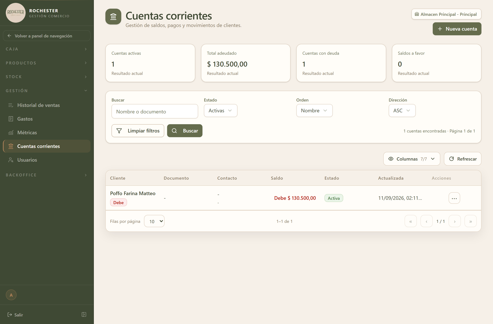

## 8. Cuentas corrientes

### 8.1 Para qué sirve

Crédito otorgado a un cliente para que compre ahora y pague después.

<!-- PROSA:cuenta-corriente.proposito -->
Administra el crédito de los clientes que compran ahora y pagan después. Cada cliente tiene una cuenta con su **saldo**, el historial de lo que compró y lo que fue pagando.

Cómo leer el saldo:

- **Saldo positivo**: el cliente **debe** esa cantidad.
- **Saldo cero**: está al día.
- **Saldo negativo**: pagó de más y tiene ese dinero **a favor**, que se aplica a sus próximas compras.

El saldo no se escribe a mano: lo mueve el sistema. Una venta a cuenta corriente lo aumenta, un pago lo reduce, y todo queda asentado en el historial de movimientos con su fecha y su responsable.
<!-- /PROSA -->

### 8.2 Cómo llegar

En el menú lateral, abra **Gestión** y elija **Cuentas corrientes**.

La pantalla se titula *Cuentas corrientes*.

### 8.3 Acciones disponibles

#### 8.3.1 Crear

<!-- PROSA:cuenta-corriente.crear.pasos -->
1. En el menú lateral, abra **Gestión** y elija **Cuentas corrientes**.
2. Presione el botón para dar de alta una cuenta.
3. Cargue el **nombre** del cliente. Es el único dato obligatorio.
4. Complete, si los tiene, **documento**, **email**, **teléfono** y **observaciones**.
5. Confirme.

La cuenta nace **activa** y con **saldo cero**.

> El documento no puede repetirse: si ya existe otra cuenta con ese número, el sistema lo avisa. Es la forma de evitar dos cuentas para el mismo cliente.
<!-- /PROSA -->

**Datos a completar**

| Campo | Tipo | Obligatorio | Reglas |
| --- | --- | --- | --- |
| `nombre` | Texto | **Sí** | Máx. 255 caracteres |
| `documento` | Texto | No | Máx. 50 caracteres |
| `email` | Correo electrónico | No | Máx. 255 caracteres |
| `telefono` | Texto | No | Máx. 50 caracteres |
| `observaciones` | Texto | No | — |

#### 8.3.2 Listar

<!-- PROSA:cuenta-corriente.listar.pasos -->
1. Ingrese a **Gestión → Cuentas corrientes**.
2. Busque por **nombre, documento o email** con el buscador; los tres campos se consultan a la vez.
3. Filtre por estado para ver solo las cuentas **activas** o solo las **inactivas**.
4. Ordene el listado por **nombre**, **saldo** o **fecha de alta**.

El listado se muestra paginado. Ordenar por saldo de mayor a menor es la manera rápida de ver quiénes son los mayores deudores.
<!-- /PROSA -->

**Filtros disponibles**

| Filtro | Tipo | Obligatorio | Observación |
| --- | --- | --- | --- |
| `(dto)` | Ver DTO `FiltroCuentaCorrienteDto` | **Sí** | — |

#### 8.3.3 Obtener resumen

<!-- PROSA:cuenta-corriente.obtenerResumen.pasos -->
Al abrir una cuenta, el encabezado resume su situación:

- **Saldo actual**: lo que el cliente debe hoy.
- **Ventas**: cuántas compró a cuenta, por qué monto original, cuánto lleva pagado y cuánto queda pendiente, con el desglose por estado (pendientes, parciales, pagadas, anuladas).
- **Pagos**: cuántos hizo y por qué total.
- **Movimientos**: cuántos registra la cuenta y cuál fue el último.
<!-- /PROSA -->

#### 8.3.4 Listar ventas

<!-- PROSA:cuenta-corriente.listarVentas.pasos -->
Muestra las compras que el cliente hizo a cuenta corriente, de la más reciente a la más antigua. De cada una indica el **monto original**, cuánto se le **aplicó** de pagos, cuánto queda **pendiente** y en qué **estado** está. Desde aquí puede abrir el detalle de la venta y ver qué productos llevó.
<!-- /PROSA -->

**Filtros disponibles**

| Filtro | Tipo | Obligatorio | Observación |
| --- | --- | --- | --- |
| `(dto)` | Ver DTO `FiltroCuentaCorrienteDetalleDto` | **Sí** | — |

#### 8.3.5 Listar movimientos

<!-- PROSA:cuenta-corriente.listarMovimientos.pasos -->
Es el extracto de la cuenta: cada deuda, cada pago y cada ajuste, con su fecha, su monto, el **saldo que quedó** después de la operación y el usuario que la registró.

Es la pantalla a la que recurrir cuando un cliente discute el saldo: la secuencia completa muestra cómo se llegó al número actual.
<!-- /PROSA -->

**Filtros disponibles**

| Filtro | Tipo | Obligatorio | Observación |
| --- | --- | --- | --- |
| `(dto)` | Ver DTO `FiltroCuentaCorrienteDetalleDto` | **Sí** | — |

#### 8.3.6 Registrar pago

<!-- PROSA:cuenta-corriente.registrarPago.pasos -->
Registra un cobro a cuenta de la deuda.

1. Abra la cuenta del cliente y elija registrar un pago.
2. Cargue el **monto** cobrado y el **medio de pago**. Si cobra con el medio **Otro**, describa de qué se trata: es obligatorio.
3. Agregue **referencia** u **observación** si necesita dejar constancia (número de transferencia, comprobante).
4. Confirme.

Al confirmar, el sistema hace tres cosas en una sola operación:

- **Imputa el pago a las ventas pendientes, de la más antigua a la más nueva.** Cada venta se marca `PAGADA` si quedó saldada o `PARCIAL` si se cubrió en parte.
- **Descuenta el monto del saldo** del cliente.
- **Registra el ingreso en la caja abierta** del almacén, identificado como cobro de cuenta corriente.

Si el pago supera lo adeudado, el excedente queda como **saldo a favor** del cliente y así se indica en el movimiento.

> Para poder cobrar tiene que haber una **caja abierta** en el almacén: el cobro es dinero que entra y necesita quedar registrado en la sesión de caja.
<!-- /PROSA -->

**Datos a completar**

| Campo | Tipo | Obligatorio | Reglas |
| --- | --- | --- | --- |
| `almacenId` | Número entero | **Sí** | — |
| `monto` | Número | **Sí** | Mínimo 0.01 |
| `medioPago` | MetodoPago | **Sí** | — |
| `detalle_pago` | Texto | No | Mín. 3 caracteres. Máx. DETALLE_PAGO_MAX_LENGTH caracteres |
| `referencia` | Texto | No | Máx. 120 caracteres |
| `observacion` | Texto | No | Máx. 500 caracteres |

**Mensajes que puede mostrar el sistema**

| Mensaje | Motivo / Cómo resolverlo |
| --- | --- |
| El monto del pago debe ser mayor a 0 | <!-- PROSA:cuenta-corriente.error.el-monto-del-pago-debe-ser-mayor-a-0 --> No cargó el importe cobrado, o cargó cero. Indique cuánto pagó el cliente. <!-- /PROSA --> |
| Cuenta corriente {cuentaId} no encontrada | <!-- PROSA:cuenta-corriente.error.cuenta-corriente-no-encontrada --> La cuenta fue eliminada o el enlace es viejo. Vuelva al listado de cuentas corrientes y búsquela de nuevo. <!-- /PROSA --> |
| No hay caja abierta para el almacen {dto.almacenId} | <!-- PROSA:cuenta-corriente.error.no-hay-caja-abierta-para-el-almacen --> No se puede cobrar con la caja cerrada: el ingreso tiene que quedar registrado en una sesión. Abra la caja del almacén desde **Caja → Gestión de caja** y vuelva a registrar el pago. <!-- /PROSA --> |

#### 8.3.7 Registrar ajuste

<!-- PROSA:cuenta-corriente.registrarAjuste.pasos -->
Corrige el saldo de una cuenta cuando la diferencia no proviene de una venta ni de un cobro: una bonificación acordada, un error de carga arrastrado, un redondeo.

1. Abra la cuenta y elija registrar un ajuste.
2. Elija el tipo: **ajuste de débito** si el cliente pasa a deber más, **ajuste de crédito** si pasa a deber menos.
3. Cargue el **monto** (siempre en positivo; el tipo define si suma o resta) y una **descripción** que explique el motivo. Ambos son obligatorios.
4. Confirme.

El ajuste modifica el saldo y queda en el historial con su descripción y su responsable.

> Un ajuste no genera movimiento de caja: no entra ni sale dinero. Si el cliente efectivamente pagó, registre un **pago**, no un ajuste.
<!-- /PROSA -->

**Datos a completar**

| Campo | Tipo | Obligatorio | Reglas |
| --- | --- | --- | --- |
| `tipo` | Opción de lista | **Sí** | — |
| `monto` | Número | **Sí** | Mínimo 0.01 |
| `descripcion` | Texto | **Sí** | Mín. 3 caracteres. Máx. 500 caracteres |

**Mensajes que puede mostrar el sistema**

| Mensaje | Motivo / Cómo resolverlo |
| --- | --- |
| El monto del ajuste debe ser mayor a 0 | <!-- PROSA:cuenta-corriente.error.el-monto-del-ajuste-debe-ser-mayor-a-0 --> El monto del ajuste tiene que ser mayor a cero. Cárguelo siempre en positivo: lo que define si suma o resta es el tipo de ajuste que elija. <!-- /PROSA --> |
| La descripcion del ajuste es obligatoria | <!-- PROSA:cuenta-corriente.error.la-descripcion-del-ajuste-es-obligatoria --> Todo ajuste manual de saldo tiene que explicar su motivo. Escriba por qué corrige el saldo: es lo que va a permitir entenderlo cuando se revise la cuenta más adelante. <!-- /PROSA --> |
| Cuenta corriente {cuentaId} no encontrada | <!-- PROSA:cuenta-corriente.error.cuenta-corriente-no-encontrada --> La cuenta fue eliminada o el enlace es viejo. Vuelva al listado de cuentas corrientes y búsquela de nuevo. <!-- /PROSA --> |

#### 8.3.8 Obtener

<!-- PROSA:cuenta-corriente.obtener.pasos -->
Haga clic en la fila del cliente para abrir su cuenta: datos de contacto, saldo actual, ventas a cuenta y extracto de movimientos.
<!-- /PROSA -->

#### 8.3.9 Actualizar

<!-- PROSA:cuenta-corriente.actualizar.pasos -->
Corrige los datos del cliente: nombre, documento, email, teléfono y observaciones. También permite volver a activar una cuenta dada de baja.

El saldo no se edita desde aquí: para corregirlo, registre un **ajuste**.
<!-- /PROSA -->

**Datos a completar**

| Campo | Tipo | Obligatorio | Reglas |
| --- | --- | --- | --- |
| `activa` | Sí / No | No | — |

#### 8.3.10 Desactivar

<!-- PROSA:cuenta-corriente.desactivar.pasos -->
Da de baja la cuenta para que no se le puedan cargar compras nuevas. La cuenta no se borra: su historial y su saldo se conservan, y puede reactivarse en cualquier momento.

> Conviene dar de baja en lugar de eliminar: así se mantiene el respaldo de lo que el cliente compró y pagó.
<!-- /PROSA -->

### 8.4 Estados y opciones

**Cuenta corriente movimiento tipo**

| Valor | Significado |
| --- | --- |
| `DEUDA` | <!-- PROSA:cuenta-corriente.cuentacorrientemovimientotipo.deuda --> Compra a cuenta corriente. Aumenta el saldo: el cliente pasa a deber más. <!-- /PROSA --> |
| `PAGO` | <!-- PROSA:cuenta-corriente.cuentacorrientemovimientotipo.pago --> Cobro recibido. Reduce el saldo y se imputa a las ventas pendientes más antiguas. <!-- /PROSA --> |
| `AJUSTE_DEBITO` | <!-- PROSA:cuenta-corriente.cuentacorrientemovimientotipo.ajuste-debito --> Corrección manual que **aumenta** la deuda del cliente. <!-- /PROSA --> |
| `AJUSTE_CREDITO` | <!-- PROSA:cuenta-corriente.cuentacorrientemovimientotipo.ajuste-credito --> Corrección manual que **reduce** la deuda del cliente, como una bonificación acordada. <!-- /PROSA --> |
| `SALDO_A_FAVOR` | <!-- PROSA:cuenta-corriente.cuentacorrientemovimientotipo.saldo-a-favor --> Dinero que quedó a favor del cliente porque pagó más de lo que debía. Se descuenta de sus próximas compras. <!-- /PROSA --> |

**Cuenta corriente medio pago**

| Valor | Significado |
| --- | --- |
| `EFECTIVO` | <!-- PROSA:cuenta-corriente.cuentacorrientemediopago.efectivo --> Pago en efectivo. Entra a la caja física y se cuenta en el arqueo del cierre. <!-- /PROSA --> |
| `TRANSFERENCIA` | <!-- PROSA:cuenta-corriente.cuentacorrientemediopago.transferencia --> Pago por transferencia bancaria. Conviene anotar el comprobante en la referencia. <!-- /PROSA --> |
| `QR` | <!-- PROSA:cuenta-corriente.cuentacorrientemediopago.qr --> Pago con código QR desde una billetera virtual. <!-- /PROSA --> |
| `DEBITO` | <!-- PROSA:cuenta-corriente.cuentacorrientemediopago.debito --> Pago con tarjeta de débito. <!-- /PROSA --> |
| `CREDITO` | <!-- PROSA:cuenta-corriente.cuentacorrientemediopago.credito --> Pago con tarjeta de crédito. <!-- /PROSA --> |
| `OTRO` | <!-- PROSA:cuenta-corriente.cuentacorrientemediopago.otro --> Cualquier medio que no figure en la lista. Al elegirlo, el sistema **exige describirlo**: es lo que permite reconocerlo después en los reportes. <!-- /PROSA --> |
| `BANCARIZADO` | <!-- PROSA:cuenta-corriente.cuentacorrientemediopago.bancarizado --> Cobro que ingresa por vía bancaria y no como efectivo en caja. <!-- /PROSA --> |

**Cuenta corriente venta estado**

| Valor | Significado |
| --- | --- |
| `PENDIENTE` | <!-- PROSA:cuenta-corriente.cuentacorrienteventaestado.pendiente --> La compra está impaga: no se le aplicó ningún pago todavía. <!-- /PROSA --> |
| `PARCIAL` | <!-- PROSA:cuenta-corriente.cuentacorrienteventaestado.parcial --> La compra se pagó en parte. Queda un monto pendiente que se cubrirá con los próximos cobros. <!-- /PROSA --> |
| `PAGADA` | <!-- PROSA:cuenta-corriente.cuentacorrienteventaestado.pagada --> La compra quedó saldada por completo. <!-- /PROSA --> |
| `ANULADA` | <!-- PROSA:cuenta-corriente.cuentacorrienteventaestado.anulada --> La venta fue anulada, de modo que ya no se le adeuda. <!-- /PROSA --> |

### 8.5 Otras validaciones del módulo

| Mensaje | Se produce en |
| --- | --- |
| Cuenta corriente {id} no encontrada | Obtener por id |
| No hay caja abierta para el almacen {almacenId} | Registrar venta cuenta corriente tx |
| Cuenta corriente {cuentaCorrienteId} no encontrada | Registrar venta cuenta corriente tx |
| La cuenta corriente {cuentaCorrienteId} esta inactiva | Registrar venta cuenta corriente tx |
| Ya existe una cuenta corriente con documento "{documento}" | Assert documento disponible |
| detalle_pago es obligatorio para pagos con medio OTRO | Validar detalle pago |
| detalle_pago no puede superar {DETALLE_PAGO_MAX_LENGTH} caracteres | Validar detalle pago |
