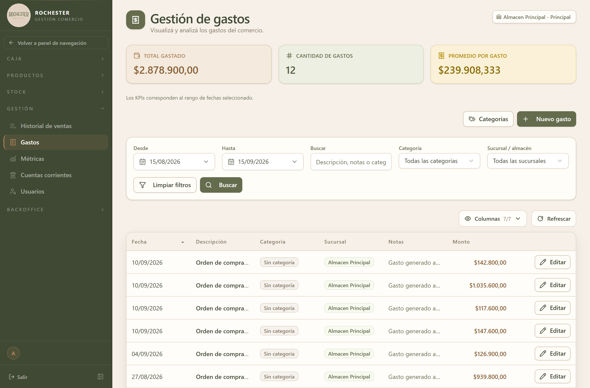

## 9. Gastos

### 9.1 Para qué sirve

<!-- PROSA:gastos.proposito -->
Registra todo lo que el negocio paga: alquiler, servicios, sueldos, mantenimiento, mercadería. Es el contrapeso de los ingresos y la base para saber cuánto quedó de resultado en un período.

Los gastos llegan por dos caminos: los que se **cargan a mano** en esta pantalla y los que el sistema **genera solo** cada vez que se registra un ingreso de mercadería de un proveedor. La columna de origen distingue unos de otros.
<!-- /PROSA -->

### 9.2 Cómo llegar

En el menú lateral, abra **Gestión** y elija **Gastos**.

La pantalla se titula *Gestión de gastos*.

### 9.3 Acciones disponibles

#### 9.3.1 Crear

<!-- PROSA:gastos.crear.pasos -->
1. En el menú lateral, abra **Gestión** y elija **Gastos**.
2. Presione el botón para registrar un gasto nuevo.
3. Cargue la **fecha**, el **monto** y una **descripción**. Los tres son obligatorios.
4. Elija la **categoría** (alquiler, servicios, sueldos…) y el **almacén** al que corresponde. Ambos son opcionales, pero cargarlos es lo que permite después agrupar y comparar.
5. Agregue **notas** si necesita más detalle.
6. Confirme.

El gasto queda registrado con origen **manual**.

> Solo se pueden usar categorías **activas**. Si la que busca no aparece, revise si fue dada de baja en **Categorías de gasto**.
<!-- /PROSA -->

**Datos a completar**

| Campo | Tipo | Obligatorio | Reglas |
| --- | --- | --- | --- |
| `fecha` | Fecha | **Sí** | — |
| `monto` | Número | **Sí** | Debe ser mayor a cero |
| `descripcion` | Texto | **Sí** | Máx. 255 caracteres |
| `notas` | Texto | No | — |
| `categoriaId` | Número entero | No | Mínimo 1 |
| `almacenId` | Número entero | No | Mínimo 1 |

#### 9.3.2 Actualizar

<!-- PROSA:gastos.actualizar.pasos -->
Corrige un gasto ya cargado: fecha, monto, descripción, notas, categoría o almacén. El monto tiene que seguir siendo mayor a cero.
<!-- /PROSA -->

**Mensajes que puede mostrar el sistema**

| Mensaje | Motivo / Cómo resolverlo |
| --- | --- |
| Gasto no encontrado | <!-- PROSA:gastos.error.gasto-no-encontrado --> El gasto fue eliminado o el enlace es viejo. Refresque el listado y búsquelo de nuevo. <!-- /PROSA --> |
| monto debe ser > 0 | <!-- PROSA:gastos.error.monto-debe-ser-0 --> El monto de un gasto tiene que ser mayor a cero. Revise el importe cargado. <!-- /PROSA --> |

#### 9.3.3 Listar categorias

<!-- PROSA:gastos.listarCategorias.pasos -->
Muestra las categorías con las que se clasifican los gastos, ordenadas alfabéticamente. Por defecto se listan solo las **activas**; puede pedir ver también las dadas de baja.
<!-- /PROSA -->

**Filtros disponibles**

| Filtro | Tipo | Obligatorio | Observación |
| --- | --- | --- | --- |
| `activo` | 'true' \| 'false' \| 'all' | No | — |

#### 9.3.4 Crear categoria

<!-- PROSA:gastos.crearCategoria.pasos -->
1. Entre a la gestión de categorías de gasto.
2. Cargue el **nombre** (obligatorio) y, si quiere, una **descripción** que aclare qué entra en esa categoría.
3. Confirme. La categoría nace activa.

> Los nombres no pueden repetirse, sin importar mayúsculas o minúsculas: "Servicios" y "servicios" se consideran la misma categoría.
<!-- /PROSA -->

**Datos a completar**

| Campo | Tipo | Obligatorio | Reglas |
| --- | --- | --- | --- |
| `nombre` | Texto | **Sí** | Máx. 100 caracteres |
| `descripcion` | Texto | No | Máx. 255 caracteres |

#### 9.3.5 Actualizar categoria

<!-- PROSA:gastos.actualizarCategoria.pasos -->
Cambia el nombre o la descripción de una categoría. Los gastos ya cargados con ella pasan a mostrar el nombre nuevo.
<!-- /PROSA -->

**Datos a completar**

| Campo | Tipo | Obligatorio | Reglas |
| --- | --- | --- | --- |
| `activo` | Sí / No | No | — |

#### 9.3.6 Desactivar categoria

<!-- PROSA:gastos.desactivarCategoria.pasos -->
Retira una categoría de la lista de opciones: deja de poder elegirse al cargar un gasto nuevo. Los gastos que ya la tenían asignada la conservan y siguen figurando en los reportes.
<!-- /PROSA -->

#### 9.3.7 Activar categoria

<!-- PROSA:gastos.activarCategoria.pasos -->
Vuelve a habilitar una categoría dada de baja para poder usarla en gastos nuevos.
<!-- /PROSA -->

#### 9.3.8 Obtener

<!-- PROSA:gastos.obtener.pasos -->
Haga clic en la fila para ver el detalle del gasto: fecha, monto, descripción, notas, categoría, almacén y origen.
<!-- /PROSA -->

**Filtros disponibles**

| Filtro | Tipo | Obligatorio | Observación |
| --- | --- | --- | --- |
| `incluirEliminados` | 'true' \| 'false' | No | — |

#### 9.3.9 Listar

<!-- PROSA:gastos.listar.pasos -->
1. Ingrese a **Gestión → Gastos**.
2. Acote con los filtros disponibles:
   - **Fechas**: desde y hasta.
   - **Búsqueda de texto**: consulta a la vez la descripción, las notas y el nombre de la categoría.
   - **Categoría**, **almacén** y **origen** (manual o generado por una orden de compra).
   - **Rango de montos**: mínimo y máximo.
3. Ordene por fecha, monto, categoría o fecha de carga.

Junto al listado, el sistema muestra el **total del período filtrado**: es la suma de todos los gastos que cumplen los filtros, no solo los de la página que está viendo. Sirve para responder "cuánto gasté en servicios este mes" en un solo paso.
<!-- /PROSA -->

**Filtros disponibles**

| Filtro | Tipo | Obligatorio | Observación |
| --- | --- | --- | --- |
| `(dto)` | Ver DTO `FiltroGastoDto` | **Sí** | — |

**Mensajes que puede mostrar el sistema**

| Mensaje | Motivo / Cómo resolverlo |
| --- | --- |
| El rango de fechas es invalido: desde > hasta | <!-- PROSA:gastos.error.el-rango-de-fechas-es-invalido-desde-hasta --> La fecha inicial es posterior a la final. Invierta el orden de las fechas. <!-- /PROSA --> |
| El rango de monto es invalido: minMonto > maxMonto | <!-- PROSA:gastos.error.el-rango-de-monto-es-invalido-minmonto-maxmonto --> El monto mínimo es mayor que el máximo. Corrija el rango. <!-- /PROSA --> |

#### 9.3.10 Eliminar

<!-- PROSA:gastos.eliminar.pasos -->
Da de baja un gasto cargado por error. El gasto deja de aparecer en el listado y de sumar en los totales, pero **no se borra**: queda archivado y puede volver a verse activando la opción de incluir eliminados.
<!-- /PROSA -->

**Mensajes que puede mostrar el sistema**

| Mensaje | Motivo / Cómo resolverlo |
| --- | --- |
| Gasto no encontrado | <!-- PROSA:gastos.error.gasto-no-encontrado --> El gasto fue eliminado o el enlace es viejo. Refresque el listado y búsquelo de nuevo. <!-- /PROSA --> |

#### 9.3.11 Eliminar def

<!-- PROSA:gastos.eliminarDef.pasos -->
Borra el gasto de forma **definitiva**. No se puede deshacer y el registro deja de existir.

> ⚠️ Reserve esta opción para datos de prueba. Para un gasto real, aunque haya sido un error, conviene la baja común: mantiene la trazabilidad de lo que se cargó.
<!-- /PROSA -->

### 9.4 Estados y opciones

**Gasto origen**

| Valor | Significado |
| --- | --- |
| `MANUAL` | <!-- PROSA:gastos.gastoorigen.manual --> Gasto cargado a mano en la pantalla de Gastos. <!-- /PROSA --> |
| `ORDEN_COMPRA` | <!-- PROSA:gastos.gastoorigen.orden-compra --> Gasto que el sistema generó solo al registrarse un ingreso de mercadería. Está atado a esa orden de compra: si la orden se anula, el gasto se elimina automáticamente. <!-- /PROSA --> |

### 9.5 Otras validaciones del módulo

| Mensaje | Se produce en |
| --- | --- |
| Gasto no encontrado | Obtener por id |
| Gasto no encontrado | Eliminar definitivo |
| Categoria de gasto no encontrada | Obtener categoria |
| La categoria de gasto esta inactiva | Obtener categoria activa |
| Almacen no encontrado | Obtener almacen |
| La categoria de gasto "{nombre}" ya existe | Assert nombre categoria disponible |
| {field} es obligatorio | Clean required |
