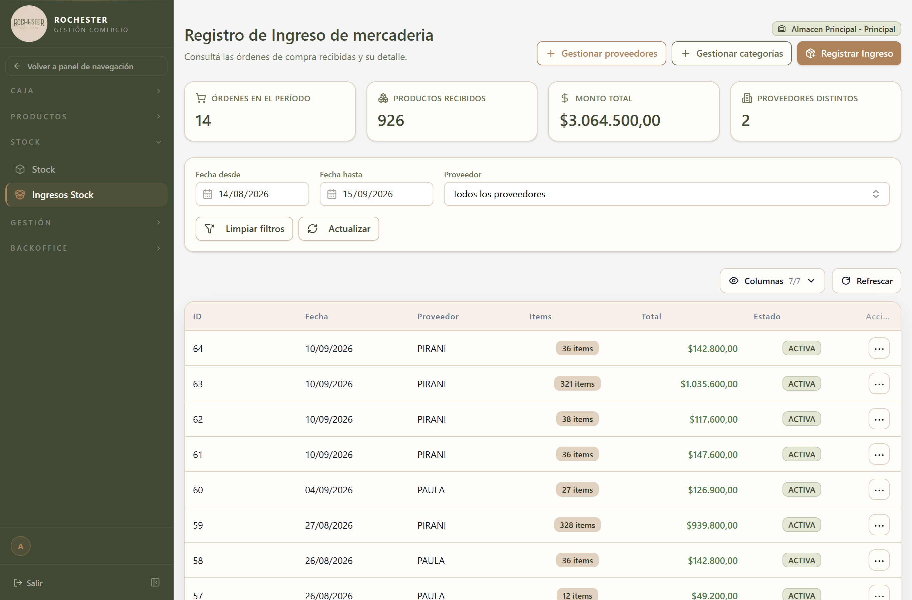

## 10. Órdenes de compra

### 10.1 Para qué sirve

Pedido de mercadería a un proveedor.

<!-- PROSA:orden-compra.proposito -->
Registra la mercadería que llega de un proveedor. Es el circuito de compra: se cargan los productos recibidos con su precio, y el sistema hace el resto en una sola operación.

Al confirmar un ingreso, el sistema suma la mercadería al stock del almacén, deja el movimiento correspondiente en el historial y **genera automáticamente el gasto** por el total de la compra, imputado a ese proveedor. No hay que cargar el gasto por separado.
<!-- /PROSA -->

### 10.2 Cómo llegar

En el menú lateral, abra **Stock** y elija **Ingresos Stock**.

La pantalla se titula *Registro de Ingreso de mercadería*.

### 10.3 Acciones disponibles

#### 10.3.1 Ingresar stock

<!-- PROSA:orden-compra.ingresarStock.pasos -->
1. En el menú lateral, abra **Stock** y elija **Ingresos Stock**.
2. Presione **Registrar Ingreso**.
3. Seleccione el **proveedor**. Si todavía no está dado de alta, cárguelo con **Gestionar proveedores**.
4. Agregue los productos recibidos. De cada uno indique la **cantidad** y el **precio unitario** al que lo compró.
5. Revise el total y confirme.

Al confirmar, en una sola operación el sistema: suma la mercadería al stock, registra los movimientos y crea el gasto asociado a la compra.

> El precio unitario se carga según cómo se venda el producto: por pieza si se vende por unidad, **por gramo** si se vende por peso. Preste atención a esto al cargar mercadería a granel: un precio por kilo cargado como precio por gramo multiplica el costo por mil.
<!-- /PROSA -->

**Datos a completar**

| Campo | Tipo | Obligatorio | Reglas |
| --- | --- | --- | --- |
| `proveedorId` | Número entero | **Sí** | — |
| `almacenId` | Número entero | **Sí** | — |
| `usuarioId` | Número entero | **Sí** | — |
| `numeroComprobante` | Texto | No | Máx. 120 caracteres |
| `observacion` | Texto | No | Máx. 1000 caracteres |
| `items` | CreateOrdenCompraItemDto (lista) | **Sí** | Al menos 1 elemento(s) |

*Detalle de `Orden compra item`*

| Campo | Tipo | Obligatorio | Reglas |
| --- | --- | --- | --- |
| `productoId` | Número entero | **Sí** | — |
| `cantidad` | Número entero | No | Mínimo 1 |
| `cantidad_gramos` | Número | No | Mínimo 0.001 |
| `precioUnitario` | Número | **Sí** | Mínimo 0.01 |
| `fechaVencimiento` | Fecha | No | — |

#### 10.3.2 Obtener todas

<!-- PROSA:orden-compra.obtenerTodas.pasos -->
1. Ingrese a **Stock → Ingresos Stock**.
2. Acote por **fecha desde**, **fecha hasta** y **proveedor**. Por defecto la pantalla muestra el último mes.
3. **Actualizar** vuelve a aplicar los filtros; **Limpiar filtros** los descarta.

El encabezado resume el período filtrado: **órdenes en el período**, **productos recibidos**, **monto total** y **proveedores distintos**.
<!-- /PROSA -->

**Filtros disponibles**

| Filtro | Tipo | Obligatorio | Observación |
| --- | --- | --- | --- |
| `(dto)` | Ver DTO `FiltroOrdenCompraDto` | **Sí** | — |

#### 10.3.3 Obtener

<!-- PROSA:orden-compra.obtener.pasos -->
Haga clic en la orden para ver su detalle: proveedor, fecha, productos recibidos con cantidades y precios, total, y el gasto que generó.
<!-- /PROSA -->

#### 10.3.4 Anular

<!-- PROSA:orden-compra.anular.pasos -->
Deja sin efecto un ingreso de mercadería cargado por error.

1. Ubique la orden en el listado y abra el menú **…** de su fila.
2. Elija **Anular**.
3. Escriba el **motivo de la anulación**. Es obligatorio y queda registrado.
4. Confirme.

Al anular, el sistema deshace el ingreso completo: **descuenta del stock** la mercadería que había sumado, registra los movimientos de reversión con el motivo indicado, y **elimina el gasto** que se había generado. La orden no se borra: queda en el listado con estado `ANULADA`, su motivo y su fecha de anulación.

> Una orden anulada no se puede volver a activar. Si el ingreso era correcto pero tenía un error de carga, conviene corregirlo con **Actualizar** en lugar de anularlo.
<!-- /PROSA -->

**Datos a completar**

| Campo | Tipo | Obligatorio | Reglas |
| --- | --- | --- | --- |
| `motivoAnulacion` | Texto | **Sí** | Mín. 3 caracteres. Máx. 500 caracteres |
| `usuarioId` | Número entero | No | Mínimo 1 |

#### 10.3.5 Actualizar

<!-- PROSA:orden-compra.actualizar.pasos -->
Corrige un ingreso ya registrado: los productos, las cantidades o los precios. El sistema recalcula el stock por la diferencia y actualiza el gasto asociado para que refleje el nuevo total.
<!-- /PROSA -->

### 10.4 Estados y opciones

**Orden compra estado**

| Valor | Significado |
| --- | --- |
| `ACTIVA` | <!-- PROSA:orden-compra.ordencompraestado.activa --> El ingreso está vigente: la mercadería está sumada al stock y el gasto, registrado. <!-- /PROSA --> |
| `ANULADA` | <!-- PROSA:orden-compra.ordencompraestado.anulada --> El ingreso fue revertido. El stock volvió a su estado anterior y el gasto se eliminó. Queda en el listado con su motivo de anulación, a efectos de auditoría. <!-- /PROSA --> |

### 10.5 Otras validaciones del módulo

| Mensaje | Se produce en |
| --- | --- |
| Producto {i.productoId} no encontrado | Crear orden con stock |
| El producto {producto.nombre} se maneja por gramos: enviar 'cantidad_gramos' (y NO 'cantidad'). | Crear orden con stock |
| El producto {producto.nombre} se maneja por piezas: enviar 'cantidad' (y NO 'cantidad_gramos'). | Crear orden con stock |
| Orden de compra {id} no encontrada | Obtener detalle |
| Orden de compra {id} no encontrada | Actualizar orden |
| La orden de compra {id} esta anulada y no puede editarse | Actualizar orden |
| La orden de compra {id} no tiene almacen asociado | Actualizar orden |
| motivoAnulacion es obligatorio | Anular orden |
| Orden de compra {id} no encontrada | Anular orden |
| La orden de compra {id} ya esta anulada | Anular orden |
| La orden de compra {id} no tiene almacen asociado para revertir stock | Anular orden |
| La orden de compra {id} no tiene items para revertir | Anular orden |
| Proveedor {proveedorId} no encontrado | Get proveedor or fail |
| Producto {i.productoId} no encontrado | Procesar items orden |
| El producto {producto.nombre} se maneja por gramos: enviar 'cantidad_gramos' y no 'cantidad'. | Procesar items orden |
| El producto {producto.nombre} se maneja por piezas: enviar 'cantidad' y no 'cantidad_gramos'. | Procesar items orden |
| El producto {producto.nombre} debe tener precioUnitario mayor a 0 | Procesar items orden |
| No hay stock actual para revertir el producto {params.producto.id} en almacen {params.almacenId} | Aplicar delta stock |
| Stock insuficiente para editar la orden. Producto {params.producto.nombre}: disponible {actual.toFixed(3)}g, requerido {Math.abs(deltaGramos).toFixed(3)}g | Aplicar delta stock |
| Stock insuficiente para editar la orden. Producto {params.producto.nombre}: disponible {actual}, requerido {Math.abs(deltaPiezas)} | Aplicar delta stock |
