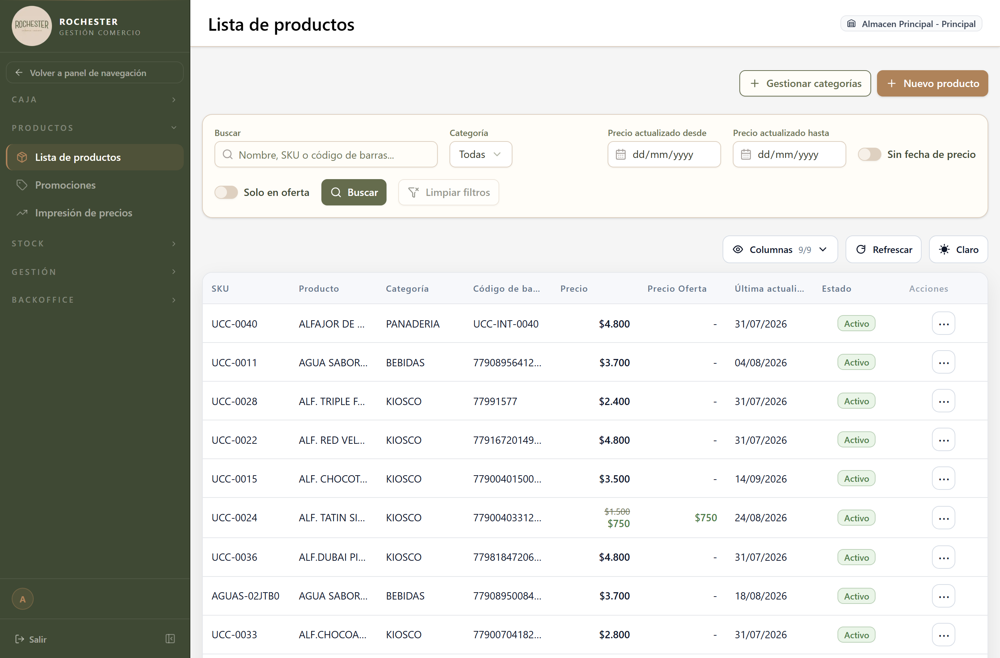

## 12. Categorías

### 12.1 Para qué sirve

<!-- PROSA:categoria.proposito -->
Agrupa los productos por rubro: bebidas, almacén, limpieza, panadería.

Las categorías son lo que permite filtrar el catálogo, ver cuánto vale el stock de un rubro y comparar cuánto vende cada uno.
<!-- /PROSA -->

### 12.2 Cómo llegar

En el menú lateral, abra **Stock** y elija **Ingresos Stock → Gestionar categorías**.

La pantalla se titula *Categorías*.

Se accede desde el botón **Gestionar categorías**, arriba a la derecha de la pantalla de ingresos de mercadería.

### 12.3 Acciones disponibles

#### 12.3.1 Get all

<!-- PROSA:categoria.getAll.pasos -->
Lista las categorías, ordenadas alfabéticamente.
<!-- /PROSA -->

#### 12.3.2 Get one

<!-- PROSA:categoria.getOne.pasos -->
Muestra el detalle de una categoría.
<!-- /PROSA -->

#### 12.3.3 Create

<!-- PROSA:categoria.create.pasos -->
1. Abra la gestión de categorías con el botón **Gestionar categorías**.
2. Cargue el **nombre** de la categoría.
3. Confirme.

> El nombre no puede repetirse. Conviene definir pocas categorías y claras: son las que después ordenan los reportes.
<!-- /PROSA -->

**Datos a completar**

| Campo | Tipo | Obligatorio | Reglas |
| --- | --- | --- | --- |
| `nombre` | Texto | **Sí** | Máx. 100 caracteres |
| `descripcion` | Texto | No | — |

#### 12.3.4 Update

<!-- PROSA:categoria.update.pasos -->
Cambia el nombre de una categoría. Los productos que la tienen asignada pasan a mostrar el nombre nuevo.
<!-- /PROSA -->

#### 12.3.5 Remove

<!-- PROSA:categoria.remove.pasos -->
Elimina una categoría.

Solo se puede eliminar una categoría **sin productos asociados**. Si tiene productos, primero reasígnelos a otra.
<!-- /PROSA -->

**Mensajes que puede mostrar el sistema**

| Mensaje | Motivo / Cómo resolverlo |
| --- | --- |
| No se puede eliminar la categoria {id} porque tiene productos asociados | <!-- PROSA:categoria.error.no-se-puede-eliminar-la-categoria-porque-tiene-productos-aso --> La categoría todavía agrupa productos, y borrarla los dejaría sin clasificar. Reasigne esos productos a otra categoría y vuelva a intentarlo. <!-- /PROSA --> |
| No se puede eliminar la categoria {id} porque tiene productos asociados | <!-- PROSA:categoria.error.no-se-puede-eliminar-la-categoria-porque-tiene-productos-aso --> La categoría todavía agrupa productos, y borrarla los dejaría sin clasificar. Reasigne esos productos a otra categoría y vuelva a intentarlo. <!-- /PROSA --> |
| Categoria {id} no encontrada | <!-- PROSA:categoria.error.categoria-no-encontrada --> La categoría fue eliminada o el enlace es viejo. Refresque el listado. <!-- /PROSA --> |

### 12.5 Otras validaciones del módulo

| Mensaje | Se produce en |
| --- | --- |
| Categoria {id} no encontrada | Find one |
