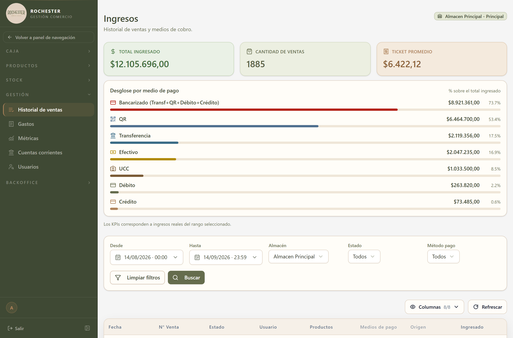

## 17. Ingresos

### 17.1 Para qué sirve

<!-- PROSA:ingreso.proposito -->
Es el registro del dinero que entra por las ventas, desglosado por medio de pago. Cada cobro de una venta deja aquí su asiento.

Es la pantalla con la que se responde "cuánto se facturó en el período y cómo se cobró": cuánto en efectivo, cuánto por transferencia, cuánto con tarjeta.
<!-- /PROSA -->

### 17.2 Cómo llegar

En el menú lateral, abra **Gestión** y elija **Historial de ventas**.

La pantalla se titula *Ingresos*.

### 17.3 Acciones disponibles

#### 17.3.1 Crear

<!-- PROSA:ingreso.crear.pasos -->
El sistema registra estos ingresos **por su cuenta** cada vez que se cobra una venta: no hay que cargarlos a mano.

El registro manual queda reservado para correcciones puntuales, y exige indicar a qué venta corresponde el cobro.
<!-- /PROSA -->

**Datos a completar**

| Campo | Tipo | Obligatorio | Reglas |
| --- | --- | --- | --- |
| `ventaId` | Número entero | **Sí** | — |
| `tipo` | MetodoPago | **Sí** | — |
| `monto` | Número | **Sí** | Debe ser mayor a cero |
| `detalle_pago` | Texto | No | Mín. 3 caracteres. Máx. DETALLE_PAGO_MAX_LENGTH caracteres |

#### 17.3.2 Obtener ingresos con filtros

<!-- PROSA:ingreso.obtenerIngresosConFiltros.pasos -->
1. En el menú lateral, abra **Gestión** y elija **Historial de ventas**.
2. Acote por:
   - **Fechas**: desde y hasta.
   - **Medio de pago**.
   - **Almacén**.
   - **Rango de montos**: mínimo y máximo.
   - **Venta** puntual, si quiere ver los cobros de una operación.
3. Ordene por fecha, monto o medio de pago.

Los resultados se muestran paginados, del más reciente al más antiguo.
<!-- /PROSA -->

**Filtros disponibles**

| Filtro | Tipo | Obligatorio | Observación |
| --- | --- | --- | --- |
| `tipo` | string | No | — |
| `ventaId` | string | No | — |
| `montoMin` | string | No | — |
| `montoMax` | string | No | — |
| `fechaDesde` | string | No | — |
| `fechaHasta` | string | No | — |
| `almacenId` | string | No | — |
| `page` | string | No | Por defecto: `1` |
| `limit` | string | No | Por defecto: `50` |
| `ordenCampo` | string | No | Por defecto: `fecha` |
| `ordenDireccion` | 'ASC' \| 'DESC' | No | Por defecto: `DESC` |

#### 17.3.3 Resumen

<!-- PROSA:ingreso.resumen.pasos -->
Resume lo cobrado en el período filtrado, agrupado por medio de pago. Es el dato que se usa para el control diario y para conciliar contra lo que informa el banco.
<!-- /PROSA -->

**Filtros disponibles**

| Filtro | Tipo | Obligatorio | Observación |
| --- | --- | --- | --- |
| `fechaDesde` | string | No | — |
| `fechaHasta` | string | No | — |
| `almacenId` | string | No | — |

### 17.5 Otras validaciones del módulo

| Mensaje | Se produce en |
| --- | --- |
| Venta con id {dto.ventaId} no encontrada | Registrar ingreso |
| detalle_pago es obligatorio para ingresos con tipo OTRO | Validar detalle pago |
| detalle_pago no puede superar {DETALLE_PAGO_MAX_LENGTH} caracteres | Validar detalle pago |
