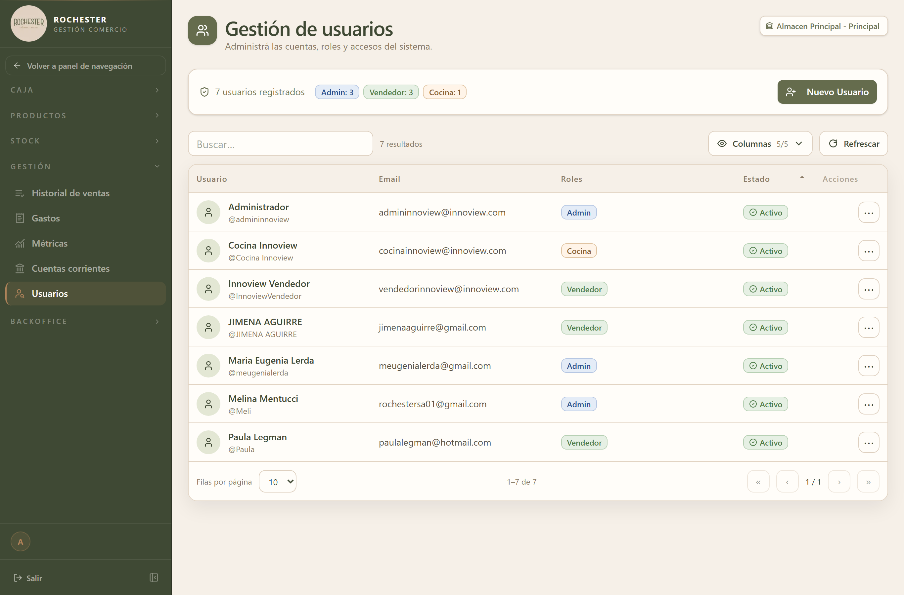

## 19. Usuarios

### 19.1 Para qué sirve

<!-- PROSA:usuario.proposito -->
Administra las cuentas de las personas que usan el sistema: quién puede entrar y qué puede hacer.

Cada usuario tiene su nombre, su email, su nombre de usuario y uno o más **roles**, que determinan a qué partes del sistema accede.
<!-- /PROSA -->

### 19.2 Cómo llegar

En el menú lateral, abra **Gestión** y elija **Usuarios**.

La pantalla se titula *Usuarios*.

### 19.3 Acciones disponibles

#### 19.3.1 Get all

<!-- PROSA:usuario.getAll.pasos -->
1. En el menú lateral, abra **Gestión** y elija **Usuarios**.
2. La lista muestra los usuarios **activos**. Puede pedir ver también los dados de baja, o todos juntos.

De cada uno figuran su nombre, su email, su nombre de usuario y los roles que tiene asignados.
<!-- /PROSA -->

**Filtros disponibles**

| Filtro | Tipo | Obligatorio | Observación |
| --- | --- | --- | --- |
| `activo` | 'true' \| 'false' \| 'all' | No | — |

#### 19.3.2 Get one

<!-- PROSA:usuario.getOne.pasos -->
Haga clic en la fila para ver el detalle del usuario y los roles que tiene.
<!-- /PROSA -->

#### 19.3.3 Create

<!-- PROSA:usuario.create.pasos -->
1. Entre a **Gestión → Usuarios** y presione el botón para crear un usuario.
2. Cargue el **nombre** de la persona, su **email** y el **nombre de usuario** con el que va a ingresar.
3. Defina una **contraseña** inicial.
4. Confirme. El usuario queda **activo**.
5. Asígnele los **roles** que correspondan editándolo: sin rol asignado, el usuario entra pero no tiene permisos.

> Entregue la contraseña inicial en persona y pida que la cambie en el primer ingreso. El sistema guarda las contraseñas cifradas: nadie, ni el administrador, puede verlas después.
<!-- /PROSA -->

**Datos a completar**

| Campo | Tipo | Obligatorio | Reglas |
| --- | --- | --- | --- |
| `nombre` | Texto | **Sí** | Máx. 255 caracteres |
| `usuario` | Texto | **Sí** | Máx. 100 caracteres |
| `password` | Texto | **Sí** | — |
| `email` | Correo electrónico | **Sí** | Máx. 255 caracteres |
| `roles` | Número entero | No | — |

#### 19.3.4 Update

<!-- PROSA:usuario.update.pasos -->
Corrige el nombre, el email o el nombre de usuario, cambia la contraseña y modifica los roles asignados.

Sobre la contraseña: si deja el campo vacío, la actual se mantiene. Cargue algo solo cuando quiera reemplazarla.

Sobre los roles: la lista que envíe **reemplaza por completo** a la anterior. Marque todos los que la persona debe tener, no solo los que agrega.
<!-- /PROSA -->

**Mensajes que puede mostrar el sistema**

| Mensaje | Motivo / Cómo resolverlo |
| --- | --- |
| El nombre de usuario '{dto.usuario}' ya está en uso. | <!-- PROSA:usuario.error.el-nombre-de-usuario-ya-esta-en-uso --> Otra persona ya usa ese nombre de usuario. Elija uno distinto. <!-- /PROSA --> |
| El rol con id {rolId} no existe. | <!-- PROSA:usuario.error.el-rol-con-id-no-existe --> Uno de los roles que intentó asignar ya no existe. Refresque la pantalla y vuelva a elegir de la lista. <!-- /PROSA --> |

#### 19.3.5 Desactivar

<!-- PROSA:usuario.desactivar.pasos -->
Da de baja al usuario: deja de poder entrar al sistema de inmediato. La cuenta no se borra, y todo lo que registró se conserva con su nombre.

Es lo que hay que hacer cuando alguien deja de trabajar en el negocio.
<!-- /PROSA -->

#### 19.3.6 Activar

<!-- PROSA:usuario.activar.pasos -->
Vuelve a habilitar una cuenta dada de baja, con sus roles y su historial intactos.
<!-- /PROSA -->

#### 19.3.7 Remove

<!-- PROSA:usuario.remove.pasos -->
Equivale a dar de baja al usuario: la cuenta se desactiva pero **no se elimina**, de modo que se mantiene la trazabilidad de las operaciones que registró.
<!-- /PROSA -->

### 19.5 Otras validaciones del módulo

| Mensaje | Se produce en |
| --- | --- |
| Usuario {id} no encontrado | Find one |
